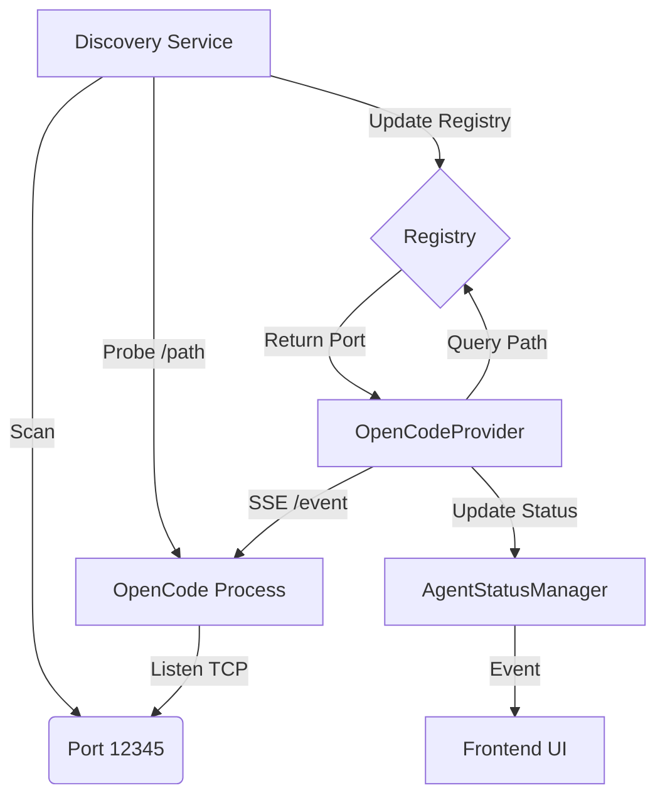

# OpenCode Integration Plan

## 1. Overview

This document outlines the architecture for integrating OpenCode as an agent provider in Chime. The integration allows Chime to detect running OpenCode instances, associate them with workspaces, and display real-time agent status (idle/busy) in the UI.

## 2. Architecture

### 2.1 High-Level Overview

The system integrates into Chime's `AgentStatusManager` framework. It uses a singleton "Discovery Service" to efficiently find local OpenCode instances and a "Provider" per workspace to stream live status updates.



### 2.2 Components

#### 1. Discovery Service (`OpenCodeDiscoveryService`)

- **Role**: A singleton service responsible for finding OpenCode instances running on the local machine.
- **Mechanism**:
  - Periodically (every 2s) scans all local TCP listening ports using the `listeners` crate.
  - Filters ports owned by `node`, `opencode`, or `code-server` processes.
  - Probes candidate ports with a `GET /path` request to identify which workspace they serve.
  - Maintains a registry: `Map<WorkspacePath, Port>`.
- **Why**: Centralizes scanning to prevent multiple providers from flooding the system with port scans (thundering herd).

#### 2. Provider (`OpenCodeProvider`)

- **Role**: One instance per Chime workspace. Implements the `AgentStatusProvider` trait.
- **Mechanism**:
  - Queries the `DiscoveryService` for the port corresponding to its workspace.
  - If found, establishes a connection to the OpenCode API.
  - Subscribes to Server-Sent Events (SSE) at `/event` for real-time updates.
  - Maintains a local count of active/idle sessions.
  - Broadcasts status changes to the `AgentStatusManager`.

#### 3. API Client (`OpenCodeClient`)

- **Role**: Typed wrapper around the OpenCode HTTP API.
- **Endpoints Used**:
  - `GET /path`: For workspace identification.
  - `GET /session`: For initial session listing.
  - `GET /event`: For real-time state changes.

## 3. Implementation Details

### 3.1 Dependencies

- `listeners`: Cross-platform port scanning (Windows, macOS, Linux).
- `reqwest` & `reqwest-eventsource`: HTTP client and SSE handling.
- `serde`: JSON parsing.
- `sst-dev.opencode`: The VSCode extension dependency.
- `thiserror`: For custom error handling.

### 3.2 Data Structures

```rust
// Custom Error Handling (Rust Expert Recommendation)
#[derive(Error, Debug)]
pub enum OpenCodeError {
    #[error("Discovery service not initialized")]
    DiscoveryNotReady,
    #[error("Connection failed: {0}")]
    ConnectionFailed(#[from] reqwest::Error),
    #[error("Stream interrupted")]
    StreamInterrupted,
    #[error("Invalid workspace path")]
    InvalidPath,
}

// Discovery Service
struct OpenCodeDiscoveryService {
    // Maps workspace path to the port it's running on
    active_instances: Arc<RwLock<HashMap<PathBuf, u16>>>,
}

// Provider
struct OpenCodeProvider {
    workspace_path: PathBuf,
    discovery_service: Arc<OpenCodeDiscoveryService>,
    // Client to interact with the API
    client: Option<Box<dyn OpenCodeClient>>,
    // Current counts
    status: Arc<RwLock<AgentStatusCounts>>,
}

// Client Interface (for mocking)
// Note: Use a concrete wrapper for Stream if BoxStream lifetimes are difficult
trait OpenCodeClient: Send + Sync {
    async fn get_workspace_path(&self) -> Result<PathBuf, OpenCodeError>;
    async fn get_sessions(&self) -> Result<Vec<Session>, OpenCodeError>;
    async fn subscribe_events(&self) -> Result<Box<dyn Stream<Item = Result<Event, OpenCodeError>> + Send + Unpin>, OpenCodeError>;
}
```

### 3.3 Key Algorithms

**Discovery Loop (in `OpenCodeDiscoveryService`):**

1.  `get_all_listeners()`
2.  Filter for `node`/`opencode`.
3.  Diff against known cache.
4.  Probe new ports: `GET http://127.0.0.1:{port}/path`.
5.  If `response.worktree == workspace_path`, cache `(path -> port)`.
6.  **Re-verification**: If a port exists in cache, occasionally re-probe to ensure it hasn't been re-assigned to a different workspace (Handling "Stale Port Re-use").

**Factory Logic (`OpenCodeProviderFactory`):**

- If `DiscoveryService` is not yet ready/initialized, `create_providers` should return an empty list or a "Waiting" provider to avoid blocking app startup.

## 4. Testing Strategy (TDD)

### 4.1 Mocking Strategy

Since we cannot rely on running real OpenCode instances during unit tests, we will mock the interactions at the edges of our system.

1.  **Mocking Port Scanning**:
    - Create a `PortScanner` trait used by `DiscoveryService`.
    - Production impl uses `listeners` crate.
    - Test impl uses a static list of ports.

2.  **Mocking HTTP/SSE**:
    - Create an `OpenCodeClient` trait used by `OpenCodeProvider`.
    - Test impl allows injecting specific `Session` lists and triggering `Event`s manually via a channel.

### 4.2 Test Scenarios

#### Discovery Service Tests (`src-tauri/src/opencode/discovery.rs`)

- **`test_discovery_loop_detects_new_instance`**:
  - Setup: Mock Scanner empty.
  - Action: Mock Scanner returns port 3000. Mock Probe returns `/foo`.
  - Assert: `get_port("/foo")` returns `Some(3000)`.
- **`test_discovery_loop_handles_process_death`**:
  - Setup: Cache has `/foo` -> 3000.
  - Action: Mock Scanner returns empty.
  - Assert: `get_port("/foo")` returns `None`.
- **`test_stale_port_reuse`** (New):
  - Setup: Cache has `/old-project` -> 3000.
  - Action: Mock Scanner returns port 3000. Mock Probe now returns `/new-project`.
  - Assert: Cache updates: `/old-project` -> None, `/new-project` -> 3000.

#### Provider Tests (`src-tauri/src/opencode/provider.rs`)

- **`test_provider_connects_when_port_discovered`**:
  - Setup: Discovery service finds port.
  - Assert: Provider connects and fetches initial status.
- **`test_live_status_updates`**:
  - Setup: Provider connected (0 active).
  - Action: Push `session.created` event via mock stream.
  - Assert: Status count becomes (1 Idle).
  - Action: Push `session.updated` (status: running).
  - Assert: Status count becomes (1 Busy).
- **`test_provider_disconnects_gracefully`**:
  - Action: Close mock stream.
  - Assert: Status becomes `NotConnected`.

## 5. Integration Plan

1.  **Update `src-tauri/Cargo.toml`**: Add dependencies.
2.  **Update `src-tauri/src/runtime_versions.rs`**: Swap Claude for OpenCode.
3.  **Create Module `src-tauri/src/opencode/`**:
    - `mod.rs`: Trait definitions.
    - `types.rs`: JSON data structures (Session, Event).
    - `discovery.rs`: Discovery Service impl.
    - `client.rs`: HTTP Client impl.
    - `provider.rs`: AgentStatusProvider impl.
4.  **Register in `src-tauri/src/lib.rs`**:
    - Initialize `OpenCodeDiscoveryService`.
    - Register `OpenCodeProviderFactory` with `AgentStatusManager`.

## 6. Verification Steps

1.  Run `pnpm tauri dev`.
2.  Open a Chime workspace.
3.  Verify the OpenCode extension installs.
4.  Open the OpenCode panel in VSCode (in Chime).
5.  Start a session/agent.
6.  Verify Chime's sidebar indicator turns "Busy" (Red).
7.  Wait for agent to finish.
8.  Verify indicator turns "Idle" (Green).
